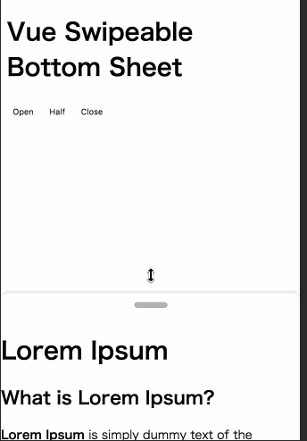

# Vue Swipeable Bottom Sheet


[](https://github.com/atsutopia/vue-swipeable-bottom-sheet)

A swipeable material's bottom sheet implementation, that uses [hammerjs](https://github.com/hammerjs/hammer.js).



## Installation

#### NPM

```
npm install --save vue-swipeable-bottom-sheet
```

or

#### Yarn

```
yarn add vue-swipeable-bottom-sheet
```

## Usage

```
<template>
  <swipeable-bottom-sheet ref="swipeableBottomSheet">
    <h1>Lorem Ipsum</h1>
    <h2>What is Lorem Ipsum?</h2>
    <p>
      <strong>Lorem Ipsum</strong> is simply dummy text of the printing and typesetting industry. Lorem Ipsum has been the industry's standard dummy text ever since the 1500s, when an unknown printer took a galley of type and scrambled it to make a type specimen book. It has survived not only five centuries, but also the leap into electronic typesetting, remaining essentially unchanged. It was popularised in the 1960s with the release of Letraset sheets containing Lorem Ipsum passages, and more recently with desktop publishing software like Aldus PageMaker including versions of Lorem Ipsum.
    </p>
  </swipeable-bottom-sheet>
</template>

<script>
import { SwipeableBottomSheet } from "vue-swipeable-bottom-sheet";

export default {
  components: {
    SwipeableBottomSheet
  },
}
</script>
```

#### mount with ssr

```
<template>
  <no-ssr>
    <swipeable-bottom-sheet ref="swipeableBottomSheet">
      <h1>Lorem Ipsum</h1>
      <h2>What is Lorem Ipsum?</h2>
      <p>
        <strong>Lorem Ipsum</strong> is simply dummy text of the printing and typesetting industry. Lorem Ipsum has been the industry's standard dummy text ever since the 1500s, when an unknown printer took a galley of type and scrambled it to make a type specimen book. It has survived not only five centuries, but also the leap into electronic typesetting, remaining essentially unchanged. It was popularised in the 1960s with the release of Letraset sheets containing Lorem Ipsum passages, and more recently with desktop publishing software like Aldus PageMaker including versions of Lorem Ipsum.
      </p>
    </swipeable-bottom-sheet>
  </no-ssr>
</template>

if (process.browser) {
  const SwipeableBottomSheet = require('vue-swipeable-bottom-sheet')
  Vue.component("swipeable-bottom-sheet", SwipeableBottomSheet)
}
```

## License

[MIT](LICENSE)
